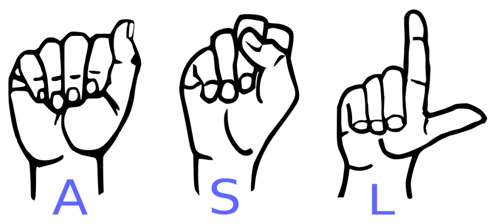
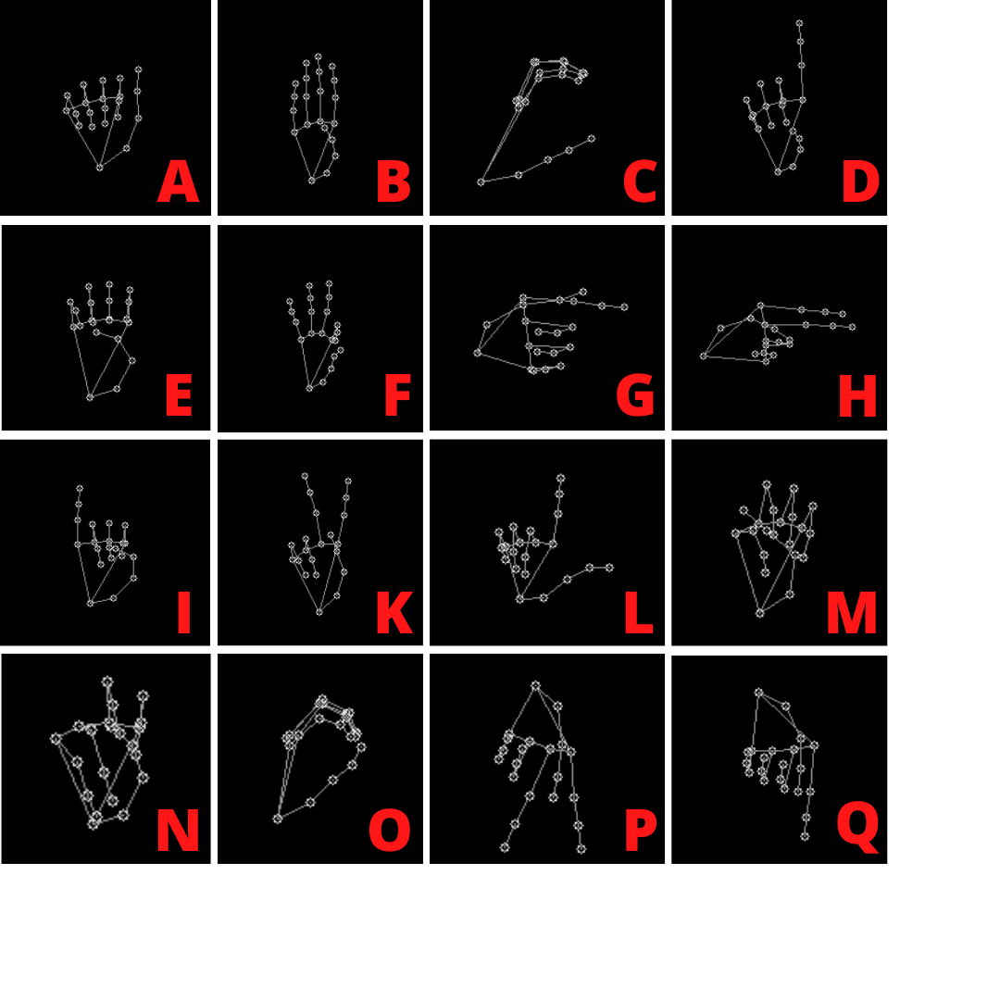

# Sign-Language-Recognition Project

  

  

## Introduction

A project that will help you translate american sign language to english alphabets. I have developed 2 interfaces :- detection in realtime and an application deployed using Flask where you can either upload an image of a sign language or you can click photos and then predict.

## Dataset Used

The dataset isnt complete yet because of unexplained reasons, but it can detect the skeletal of the hand, where a proper dataset can be made in the future.

 

**Below are some pics of the dataset**

 

## Limitations
- Not able to detect correctly
- Detecting only right hand.
- Covering A-Z alphabets excluding J and Z.
- Unable to detect J and Z as they are moving signs in ASL.

